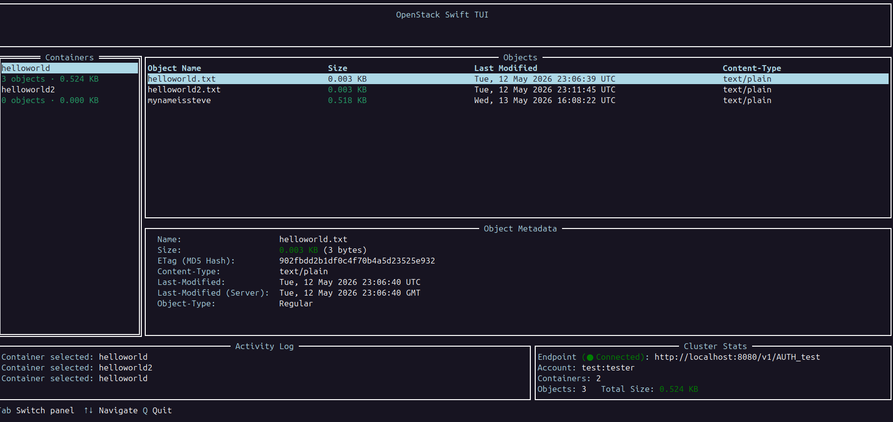

# swift-tui
[](https://goreportcard.com/report/github.com/NateMartes/swift-tui)
[](https://github.com/NateMartes/lotlytics/commits)
[](LICENSE)

A TUI application for OpenStack Swift. (W.I.P)



## Features
- Viewing Swift cluster resources and polices
- Connection to Swift cluster using tempauth middleware or a clouds.yaml file

## Building and Running

1. Using `make`:
```bash
make build
./bin/swift-tui
```
2. From source:
```bash
go build -o bin/swift-tui ./cmd
./bin/swift-tui
```

## Arguments
- `-a`, `--api-key` `string` — The API key/password to log in with to OpenStack Swift's TempAuth middleware
- `-n`, `--cloud-name` `string` — Cloud to use in the `clouds.yaml` file to connect to OpenStack Swift
- `-c`, `--clouds-file-path` `string` — Use an OpenStackClient (aka OSC) `clouds.yaml` file to log in to OpenStack Swift
- `-d`, `--debug` — Turn on debug messaging
- `-h`, `--help` — Display help message
- `-l`, `--no-https` — Signal to not use HTTPS when connecting to OpenStack Swift
- `-s`, `--swift-hostname` `string` — The hostname to use to connect to OpenStack Swift *(default: `localhost`)*
- `-p`, `--swift-port` `int` — The port to use to connect to OpenStack Swift *(default: `8080`)*
- `-u`, `--username` `string` — The username to log in with to OpenStack Swift's TempAuth middleware

## Dependencies
- [tcell](https://github.com/gdamore/tcell/) -- Used for TUI event handling
- [tview](https://github.com/rivo/tview) -- Used for TUI development
- [pflag](https://github.com/spf13/pflag) -- Used for argument parsing
- [ncw/swift](https://github.com/ncw/swift) -- Used to interact with OpenStack Swift clusters
